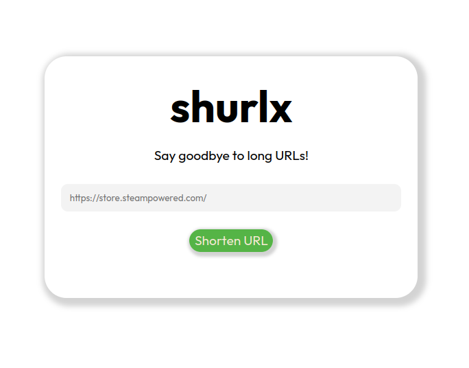

# shurlx

shurlx is a very simple URL shortener. The backend is written in C++ and uses a SQLite in-memory database to store original and shortened URLs,
while the frontend is written in simple plain HTML, CSS and JS for backend interaction. This project is molty just for fun and learning purposes about
databases, backend development and Docker.

## Getting Started

To get started with shurlx, you need to have Docker and Docker Compose installed on your machine. Then:

1. Clone the repository and navigate to the project directory.

```bash
# Clone the repository
git clone https://github.com/landiluigi746/shurlx.git
cd shurlx
```

2. Create a .env file with your desired configuration for the backend.

```
BUILD_TYPE=Debug
MAX_URL_TIME=86400 # refers to the maximum time in seconds a shortened URL will be valid
MAX_RAND_STR_LEN=6
ORIGIN=http://localhost # the origin URL for the frontend
```

3. Build and start the Docker containers.

```bash
docker-compose up --build -d
```

Now you can access the frontend at <http://localhost> and backend at <http://localhost:8080>


